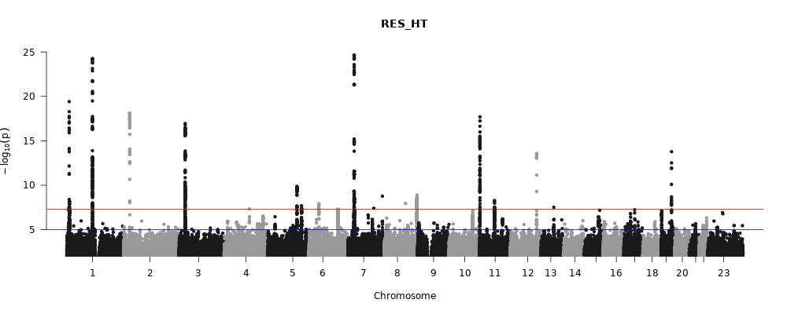
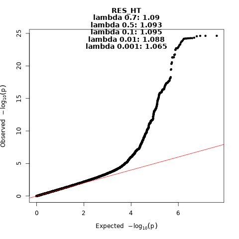
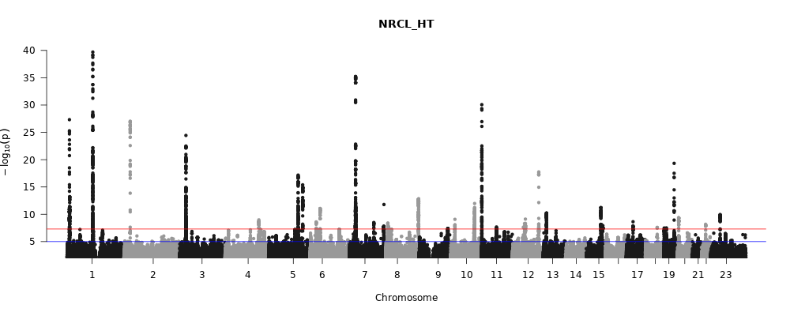
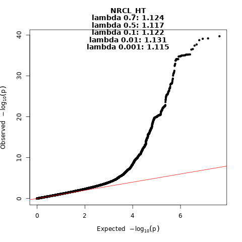
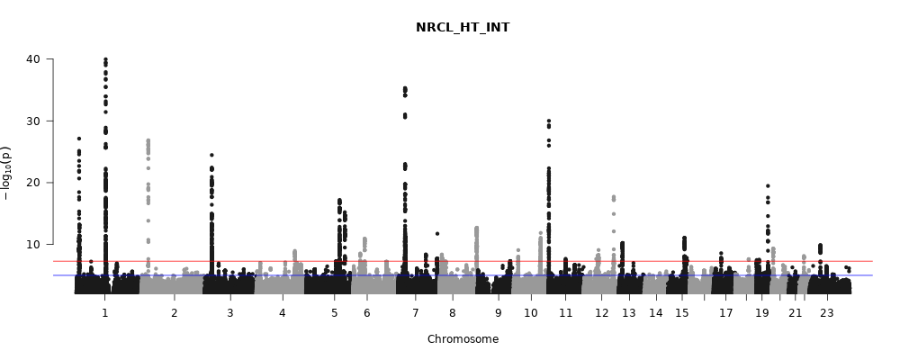
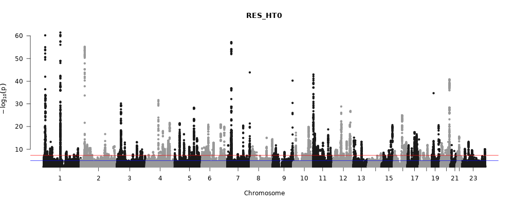
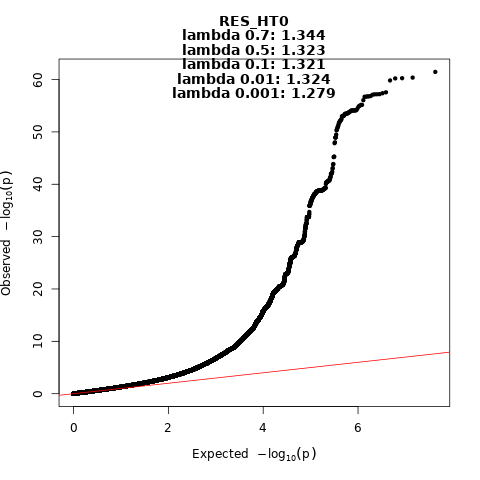
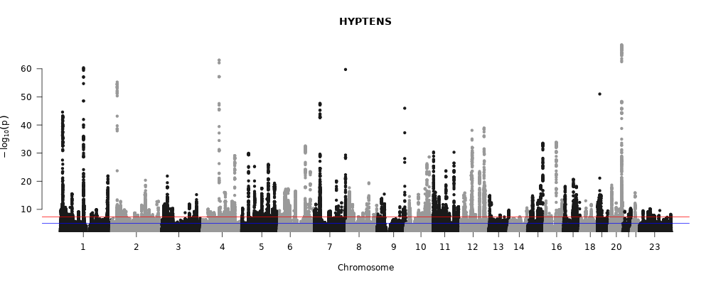
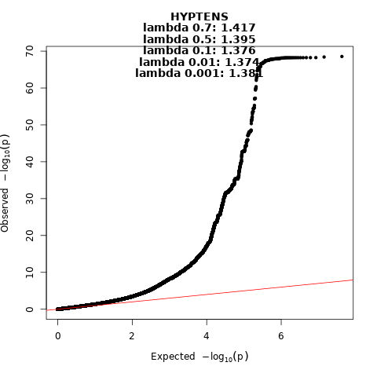

```{r setup}

knitr::opts_chunk$set(echo = TRUE, warning=FALSE, message=F)

```

<details><summary>**Libraries**</summary>

```{r libraries, class.source = 'fold-show'}

library(tidyverse)
library(data.table) # fread() function
library(gridExtra)  # plots to grid
library(visdat)     # visualization of tibble and na's
library(kableExtra) # Pretty tables
library(tableone)   # Characteristics table
#install.packages("packages/dotgen_0.1.0.tar.gz", repos=NULL)
#install.packages("packages/qvalue_2.30.0.tar.gz", repos=NULL)
library(slider)
library(fuzzyjoin)
library(bigrquery)

fg_path <- "/finngen/library-red/finngen_R12"
data_path <- "data"
font_size <- 12

source("scripts/functions.R")

```

</details>

<br>

# Data

<br>

## Definitions

<br>

Our aim is to create a new endpoint for **medication resistant hypertension**.
We will read detailed information from different hypertension medicines from drug purchase register and select cases, where minimum four different medicines have been purchased within three months period.

**Included ATC codes:**

-   C02

    -   Include all, except C02KX
    -   Two medicines: Group C02L

-   C03

    -   Include all.
    -   Two medicines: C03E

-   C07

    -   Include all.
    -   Two medicines: Groups C07B, C07C, C07D, C07FB

-   C08

    -   Include all.
    -   Two medicines: Group C08G

-   C09

    -   Include all.
    -   Two medicines: C09BA, C09BB, C09BX02, C09BX05, C09DA, C09DB, C09DX02, C09DX04, C09DX05, C09XA52
    -   Three medicines: C09BX01, C09BX03, C09BX04, C09DX01, C09DX03, C09DX06, C09DX07, C09XA54

<br>

**Drug classes:**

-   Diuretics
-   ACE inhibitors (ACEI)
-   Angiotensin II receptor blockers (ARB)
-   Calcium chanel blockers (CCB)
-   Beta blockers (BB)
-   Other

**Datasets**


 *   Count variable NRCL_HT 
   - Maximum number of different antihypertensive medicine *classes* within 3 months window
   - Only persons with diagnosed hypertension I9_HYPTENS and > 0 medicines
   - Normalized version: NRCL_HT_INT

*   Binary variable RES_HT
   -   Cases:  >= 4 drug classes within 3 months time window *and* I9_HYPTENS.
   -   Controls: 1 drug purchase and I9_HYPTENS.


*   Binary variable RES_HT0
   -   Cases:  >= 4 drug classes within 3 months time window *and* I9_HYPTENS.
   -   Controls: 0 drug purchases and no I9_HYPTENS.


<br>

## Create drug use variables

<br>

**Copy and preprocess outside the R**

Endpoint file is transfered and unzipped.
Entries of interest are selected from endpoint file prior to import to R, because the original phenotype file is very large.

Pattern: grep 'PURCH' <in-file> \| grep ' C0[2,3,7,8,9]'

```{bash, eval=F}

phenodir="/finngen/library-red/finngen_R12/phenotype_1.0"
datadir="/home/ivm/res_ht/data"
zgrep 'PURCH\|FINNGENID'  $phenodir/data/finngen_R12_detailed_longitudinal_1.0.txt.gz | grep '\sC0[2,3,7,8,9]\|FINNGENID' | gzip > $datadir/R12_detailed_C0.txt.gz &

```

<br>

**Number of drugs per code**

We check if our R12 data has ATC codes missing from our previous R10 based ATC-list.
Missing definitions are added by hand to definition file if necessary.

```{r drug definitions2, eval=F}

#Read data in.
#df0_test <- fread(str_glue("{data_path}/long_det_fake_filt_test.tsv"))
atc.curr <- fread(str_glue("{data_path}/R12_detailed_C0.txt.gz")) %>%
  select(ATC=CODE1) %>%
  distinct
atc.prev <- fread(str_glue("{data_path}/ATC_codes_r10.csv")) 
#atc.prev <- fread(str_glue("{data_path}/ATC_codes_r12.csv")) 

atc.curr %>%  anti_join(atc.prev, by="ATC")

```


**Moving sum of drug purchases**

First we calculate moving sum for drug purchases within the 3 months window.
Then we create file for cases in 'endpoint format'.

Searching unique medicines and handling strings in each window is slow, so this is run as a separate Rscript.

```{bash class.source = 'fold-show', eval = F}

Rscript scripts/gen_res_r12.R &

```

<br>

# Data: All ages

Read in phenotype data

```{r, eval=F}

# Scope and project id to BigQuery
bq_auth(scopes="https://www.googleapis.com/auth/bigquery")
projectid = "fg-production-sandbox-20"

#Tables
table_ep = "finngen-production-library.sandbox_tools_r12.endpoint_cohorts_r12_v1"
table_min = "finngen-production-library.sandbox_tools_r12.minimum_extended_r12_v1"

#vars_download <-  c("I9_HYPTENS","DEATH")
vars_download <- fread("scripts/fg_pheno_short.txt", header = F) %>% pull(V1)

phenotypes <- load_fg_variables(vars_download, table_ep, table_min, projectid )
fwrite(phenotypes, "data/finngen_R12_HT.txt.gz", sep="\t")

phenotypes %>% summary() 
```

Analysis covariates:

```{r, eval=F}

covs_tmp <- fread(str_glue("{fg_path}/analysis_covariates/R12_COV_PHENO_V2.FID.txt.gz")) %>%
  select(FID, IID, SEX_IMPUTED, AGE_AT_DEATH_OR_END_OF_FOLLOWUP, starts_with("PC"), IS_FINNGEN2_CHIP, contains("_norm", ignore.case = F))

fwrite(covs_tmp, str_glue("{data_path}/gwas_covs_r12.txt.gz"), sep="\t")

```


## Combine and preprocess 

The input file for the new enpoints includes only events with NRMED_MAX \> 0.
When combined with full fenotype file NA's are introduced.
These are replaced with values when appropriate.

```{r load, combine and process}

#endpoints and covariates
phenotypes <- fread(str_glue("{data_path}/finngen_R12_HT.txt.gz")) 
htres <- fread(str_glue("{data_path}/nrmed_max_r12.tsv.gz"))
phenomin <- fread(str_glue("{fg_path}/phenotype_1.0/data/finngen_R12_minimum_1.0.txt.gz")) 
covs_in <- fread(str_glue("{data_path}/gwas_covs_r12.txt.gz")) %>%
  rename(FINNGENID = FID) %>%     #At this point we just want sex.  Other GWAS covariates later
  select(FINNGENID, SEX_IMPUTED)

#HT_RES and HT_RES_CL were originally created in script gen_res_ht.R as moving sum, and not here, because that's only way to get age and year correct. For example in case where nrmed_max == 6, we should use age when nrmed_max==5 is first time reached, not when maximum is reached. 

#After definitions changed, whe do not use anymore original HT_RES or HT_RES_CL, but new variables which are created at this step. We omit age and year variables for them. Age is needed for outcomes, not for exposures.  

df_all <- phenomin %>%
  left_join(covs_in, by = "FINNGENID") %>%   #This represent official genotyped dataset
  left_join(htres, by = "FINNGENID") %>%
  left_join(select(phenotypes, -BL_AGE, -BL_YEAR, -SEX), by = "FINNGENID") %>%
  
  mutate(
         female = SEX_IMPUTED,
    
         #These include all values; all values I9_HYPTENS are allowed. For NRMED_MAX NA's are set as 0. 
         NRMED_MAX = if_else(is.na(NRMED_MAX), 0L, NRMED_MAX),    
         NRMED_MAX_AGE = if_else(NRMED_MAX == 0, NA_real_, NRMED_MAX_AGE),
         NRMED_MAX_YEAR = if_else(NRMED_MAX == 0, NA_integer_, NRMED_MAX_YEAR),
         NRCLASS_MAX = if_else(is.na(NRCLASS_MAX), 0L, NRCLASS_MAX),
         NRCLASS_MAX_AGE = if_else(NRCLASS_MAX == 0, NA_real_, NRCLASS_MAX_AGE),
         NRCLASS_MAX_YEAR = if_else(NRCLASS_MAX == 0, NA_integer_, NRCLASS_MAX_YEAR),
         
         #These include only values where I9_HYPTENS == 1 and NRMED_MAX > 0, rest are set as NA 
         NRMED_HT = if_else(I9_HYPTENS == 1 & NRMED_MAX > 0, NRMED_MAX, NA_integer_),
         NRMED_HT_AGE = if_else(I9_HYPTENS == 1, NRMED_MAX_AGE, NA_real_),
         NRMED_HT_YEAR = if_else(I9_HYPTENS == 1, NRMED_MAX_YEAR, NA_integer_),         
         NRCL_HT = if_else(I9_HYPTENS == 1 & NRCLASS_MAX > 0, NRCLASS_MAX, NA_integer_),
         NRCL_HT_AGE = if_else(I9_HYPTENS == 1, NRCLASS_MAX_AGE, NA_real_),
         NRCL_HT_YEAR = if_else(I9_HYPTENS == 1, NRCLASS_MAX_YEAR, NA_integer_),

           #Two class variable/mild HT as control
         RES_HT = case_when(
           NRCLASS_MAX == 1 & I9_HYPTENS == 1 ~ 0L,
           NRCLASS_MAX >= 4 & I9_HYPTENS == 1 ~ 1L,
           TRUE ~ NA_integer_
         ), 
          
         #Two class variable/healthy control 
         RES_HT0 = case_when(
           NRCLASS_MAX == 0 & I9_HYPTENS == 0 ~ 0L,
           NRCLASS_MAX >= 4 & I9_HYPTENS == 1 ~ 1L,
           TRUE ~ NA_integer_
         ),
         
         #Three class variable from variables above 
         RES3_HT0 = case_when(
           NRCLASS_MAX == 0 & I9_HYPTENS == 0 ~ "Healthy",
           NRCLASS_MAX == 1 & I9_HYPTENS == 1 ~ "Mild",
           NRCLASS_MAX >= 4 & I9_HYPTENS == 1 ~ "Resistant",
           TRUE ~ NA_character_
         ) %>% factor(levels=c("Healthy", "Mild", "Resistant")),
         
        
         #Wider definition of hypercholesterolaemia, includes also statin medication
         HYPCHOL_WIDE = if_else(E4_HYPERCHOL == 1 | RX_STATIN ==1, 1, 0)) %>% 
  
  rowwise() %>%
  mutate(HYPCHOL_WIDE_AGE = min(E4_HYPERCHOL_AGE,RX_STATIN_AGE)) %>%
  ungroup() %>%
  relocate(c(contains("I9_"),contains("RX_")), .after = last_col()) %>%
  rename_at(vars(contains('I9_')), list(~str_remove(., "I9_"))) %>%
  rename_at(vars(contains('RX_')), list(~str_remove(., "RX_"))) %>%
  rename_at(vars(contains('E4_')), list(~str_remove(., "E4_"))) %>%
  rename_at(vars(contains('N14_')), list(~str_remove(., "N14_"))) %>%
  rename_at(vars(contains('F5_')), list(~str_remove(., "F5_")))  %>%
  
  #NA's in disease covariates set as 0. These NA's represent similar variables,
  #are present for GWASes and are not relevant for us.  
  mutate_at(c( "DIABETES", "OBESITY", "HYPCHOL_WIDE"), as.integer) %>%
  mutate_at(c( "DIABETES", "OBESITY", "HYPCHOL_WIDE"), ~if_else(is.na(.), 0L, .))

#Remove individuals with no SEX_IMPUTED - they don't have genetic covariates
df <- df_all %>% filter(!is.na(female))

```


## Rank based inverse normal transformation

We will run direct rank based inverse normal transformation (INT) directly to our count phenotype (direct INT).
Even this transformation is meant for continuous data, in some earlier publications it is used also for count data.

```{r INT transformation}

df <- df %>%
  mutate(NRCLASS_INT = qnorm((rank(NRCLASS_MAX,na.last="keep")-0.5)/sum(!is.na(NRCLASS_MAX))),
         NRCL_HT_INT = qnorm((rank(NRCL_HT,na.last="keep")-0.5)/sum(!is.na(NRCL_HT))) 
         )

```

<br>


**Transformed count variables**

Summary statistics, histograms and CDFs.

```{r histograms for INT, fig.width=10, fig.height=8}
#Huomaa, että seurantaa alkaa vuodesta 1994!!!

df %>%
  select(NRCLASS_INT, NRCL_HT_INT)%>%
  #mutate_all(as.factor) %>%
  summary()

par(mfrow=c(1,2))
hist(df$NRCL_HT_INT)
ecdf(df$NRCL_HT_INT) %>% plot()
par(mfrow=c(1,1))

```


<br>


## Characteristics {.tabset}

<br>

**Number of individuals**


```{r ns1}
#Note: Followup for drug pruchase register starts from year 1994

#Number of individuals:
c("Number of all R12 individuals:", dim(phenomin)[1])
c("Number of individuals at 'endpoint file':", dim(phenotypes)[1])
```


<details><summary>Summary, all data</summary><br>
```{r}
df_all %>% mutate_if(is.character, as.factor) %>% mutate_at(c("FINNGENID"), as.character) %>% summary()
```
</details><br>


```{r}
c("Number of individuals, with genetic covariates:", dim(covs_in)[1]) 
```


```{r ns2}
tmp <- df_all %>% 
  filter(HYPTENS == 1) 
c("Number of all hypertensive individuals:", dim(tmp)[1])
```
<br>

<details><summary>Summary, All hypertensive individuals</summary><br>
```{r}
tmp%>% mutate_if(is.character, as.factor) %>% mutate_at(c("FINNGENID"), as.character) %>% summary()
```
</details><br>

```{r ns3}
tmp <- df %>% 
  filter(HYPTENS == 1) 
c("Number of all hypertensive individuals with genetic covariates:", dim(tmp)[1])
```
<br>

<details><summary>Summary, hypertensive with genetic covariates</summary><br>
```{r}
tmp %>% mutate_if(is.character, as.factor) %>% mutate_at(c("FINNGENID"), as.character) %>% summary()
```
</details><br>


```{r ns4}
#We don't have corresponding set in UKBB replication
tmp <- df %>% 
  filter(HYPTENS == 1, NRMED_MAX > 0) 
c("Number of all hypertensive individuals with medication and with genetic covariates:", dim(tmp)[1])
```
<br>

<details><summary>Summary, hypertensive with genetic covariates and with one medication</summary><br>
```{r}
tmp %>% mutate_if(is.character, as.factor) %>% mutate_at(c("FINNGENID"), as.character) %>% summary()
```
</details><br>


**Count variables**

Summary statistics and histograms. 

* NRCLASS_MAX: Number of hypertensive drug classes, including healthy individuals
* NRCLASS_MAX: Number of hypertensive drug classes, excluding healthy individuals

```{r histograms, fig.width=7, fig.height=3 }

#htres %>%
#  mutate_at(c("NRMED_MAX", "NRCLASS_MAX", "HTRES", "HTRES_CL"), as.factor) %>%
#  summary()

df %>%
  select(starts_with("NRCLASS_MAX"), starts_with("NRCL_HT")) %>%
  #mutate_at(c("NRMED_MAX", "NRCLASS_MAX", "HTRES", "HTRES_CL"), as.factor) %>%
  summary()


p1 <- ggplot(df, aes(x=factor(NRCLASS_MAX)))+
  geom_bar(stat="count",  fill="steelblue") +
  theme_minimal() 

p2 <- ggplot(df, aes(x=factor(NRCL_HT)))+
  geom_bar(stat="count",  fill="steelblue") +
  scale_x_discrete(na.translate = FALSE) + 
  theme_minimal() 

grid.arrange(p1, p2, ncol=2)

```

<br>


<details><summary>**Levels and some correlations**</summary>

```{r  class.source = 'fold-show'}

#For count variables: if count ==0,  *_AGE = NA
tmp1 <- table(df$NRMED_MAX) 
tmp1[tmp1<5] <-NA
tmp1 

tmpHT <- table(df$NRMED_HT)
tmpHT[tmpHT<5] = NA
tmpHT

table(df$NRCLASS_MAX)
table(df$NRCL_HT)


cor(df$NRMED_MAX, df$NRCLASS_MAX, use="complete.obs")
cor(df$NRMED_HT, df$NRCL_HT, use="complete.obs")

```

</details>

**Categorical variables**

Number of cases and controls:

```{r ns categorical vars}


myfacts <- c("RES_HT", "RES_HT0","HYPTENS", "ANTIHYP")
df %>%
  select(all_of(myfacts)) %>%
  mutate_all(as.factor) %>%
  summary()

```

### Resistant hypertension

```{r }

#These variables were used in cox models
names_ep <- list("CVD_HARD", "CHD","HEARTFAIL", "STR_EXH", "INTRACRA",  "RENFAIL")
covs <- c("female", "DIABETES", "OBESITY", "HYPCHOL_WIDE") 

#Number of resistant hypertension
df %>%
  create_n_table("RES3_HT0", covs, names_ep) %>% 
  my.kable()%>%
  kable_styling(font_size = font_size)

```

Age

```{r}
df %>% 
  group_by(RES3_HT0) %>%
  summarise(mean_end_age=round(mean(AGE_AT_DEATH_OR_END_OF_FOLLOWUP),2), sd_end_age=round(sd(AGE_AT_DEATH_OR_END_OF_FOLLOWUP),2)) %>%
  my.kable()%>%
  kable_styling(font_size = font_size)
```


### Number of medicine classes

```{r }

#Number of medicine classes
df %>%
  create_n_table("NRCL_HT", covs, names_ep) %>% 
  my.kable()%>%
  kable_styling(font_size = font_size)

```


Age

```{r}
df %>% 
  group_by(NRCL_HT) %>%
  summarise(mean_end_age=round(mean(AGE_AT_DEATH_OR_END_OF_FOLLOWUP),2), sd_end_age=round(sd(AGE_AT_DEATH_OR_END_OF_FOLLOWUP),2)) %>%
  my.kable()%>%
  kable_styling(font_size = font_size)
```


## {-}

## Create regenie phenofile

Output is joined to bgen-sample list and written out.

```{r}

outcomes <- c("RES_HT", "RES_HT0", "NRCL_HT", "NRCL_HT_INT", "HYPTENS")

gwas_pheno <- fread(str_glue("{data_path}/gwas_covs_r12.txt.gz")) %>%
  left_join(select(df, all_of(c("FINNGENID", outcomes))), by = c("FID" = "FINNGENID"))

fwrite(gwas_pheno, "data/pheno_regenie_resht_r12.tsv.gz", sep="\t", na="NA", quote=F)

#Check if the order is the same as in bgen-file

pheno_by_bgen <- fread("/finngen/library-red/finngen_R12/bgen_2.0/data/finngen_R12.sample") %>% 
  slice(-1) %>%
  rename(FINNGENID = ID_1) %>%
  select(FINNGENID) %>%
  left_join(gwas_pheno, by = c("FINNGENID" = "FID")) %>%
  select(-IID)

fwrite(pheno_by_bgen, "data/pheno_finemap_resht_r12.tsv.gz", sep="\t", na="NA", quote=F)

```


<details><summary>Variable summaries</summary>
<br>

```{r}
gwas_pheno %>% 
  mutate_at(outcomes, as.factor) %>% 
  summary()

```

</details>
<br>

# Run GWAS
<br>


## GWAS is run in Regenie pipeline


**Variables**

* RES_HT: Cases: 4+ hypertensive medicine classes, Control: 1 Medicine class
* RES_HT0: Cases: 4+ hypertensive medicine classes, Control: Healthy
* NRCL_HT: Number of hypertensive medicine classes
* NRCL_HT_INT: Number of hypertensive medicine classe1s normalized.


```{bash class.source = 'fold-show', eval=F}
cp data/pheno_regenie_resht_r12.tsv.gz regenie_input_resht12/
cp data/pheno_finemap_resht_r12.tsv.gz regenie_input_resht12/
dir1=anni/pipeline_input
dir2=/finngen/red/$dir1/regenie_input_resht12

#Copy pipeline input to /finngen/red
gsutil -m cp -r regenie_input_resht12  gs://fg-production-sandbox-20-red/$dir1/

#Binary variables
finngen-cli request-workflow --wdl $dir2/RegenieDF12-1.wdl \
               --input $dir2/regenie_resht_bin_R12.json \
                --dependencies $dir2/subwdls.zip 

#Continuous variables
finngen-cli request-workflow --wdl $dir2/RegenieDF12-1.wdl \
               --input $dir2/regenie_resht_cont_R12.json \
                --dependencies $dir2/subwdls.zip 

```

**Copy results**


```{bash, eval=F}

pipeline_id="fec4950e-3a68-4293-9c94-fdca38b34ea7"
pipeline_path="/finngen/pipeline/cromwell/workflows/regenie/$pipeline_id/call-sub_step2/*/sub.regenie_step2/*"
my_out="data/regenie_r12"

#find $pipeline_out -name "*.png" -print

find $pipeline_path/call-summary/ -name "*.txt" -type f -exec cp {} $my_out \;
find $pipeline_path/call-gather/ -name "*.png" -type f -exec cp {} $my_out \;
find $pipeline_path/call-gather/ -name "*.gz" -type f -exec cp {} $my_out \;
find $pipeline_path/call-gather/ -name "*.tbi" -type f -exec cp {} $my_out \;

pipeline_id="08da2d58-e36a-474a-8bec-37442c3c8d61"
pipeline_path="/finngen/pipeline/cromwell/workflows/regenie/$pipeline_id/call-sub_step2/*/sub.regenie_step2/*"
my_out="data/regenie_r12"

#find $pipeline_out -name "*.png" -print

find $pipeline_path/call-summary/ -name "*.txt" -type f -exec cp {} $my_out \;
find $pipeline_path/call-gather/ -name "*.png" -type f -exec cp {} $my_out \;
find $pipeline_path/call-gather/ -name "*.gz" -type f -exec cp {} $my_out \;
find $pipeline_path/call-gather/ -name "*.tbi" -type f -exec cp {} $my_out \;


```

**Add rsid to gwas summaries**

We need to create rsid annotation for the full gwas summaries. Python script is from /finngen/library-green/scripts/annotate_rsids/rsidify.py
Individual files for each chromosome are created and merged. 

```{bash, eval=F}

rsid_mapping="/finngen/library-green/dbsnp/dbsnp-b155-hg38-left-align-split.vcf.gz"
dir="data/regenie_r12"

#rsid's mapped to gwas summary
for NAME in RES_HT RES_HT0 NRCL_HT NRCL_HT_INT HYPTENS 
do
  gwassum_in="$dir/$NAME.gz"
  python3 scripts/rsidify.py $gwassum_in --reference $rsid_mapping -c "#chrom" -p "pos" -r "ref" -a "alt" | gzip > $dir/${NAME}_rs.gz &
done

#CHROM GENPOS ID ALLELE0 ALLELE1 A1FREQ A1FREQ_CASES A1FREQ_CONTROLS INFO N TEST BETA SE CHISQ LOG10P EXTRA
#1 13668 chr1_13668_G_A G A 0.00604911 0.00601696 0.00612898 0.294094 55733 ADD -0.0032707 0.163267 0.000401314 0.00699731 NA

```

Modify input for meta-analysis: N-column is added from regenie-output

```{bash, eval=F}

rsid_mapping="/finngen/library-green/dbsnp/dbsnp-b155-hg38-left-align-split.vcf.gz"
dir="data/regenie_r12"

#rsid's mapped to gwas summary
for NAME in RES_HT RES_HT0 NRCL_HT NRCL_HT_INT HYPTENS 
do
  paste <(zcat $dir/${NAME}_rs.gz) <(zcat $dir/${NAME}.regenie.gz | cut -f 10 -d " ") | gzip > $dir/${NAME}_rsn.gz &
done

```


## Finemapping


Finemapping

```{bash  class.source = 'fold-show', eval=F}

dir1=anni/pipeline_input
dir2=/finngen/red/$dir1/regenie_input_resht12
#Copy input files and summary stats to /finngen/red .. make sensible regexp...
gsutil -m cp -r regenie_input_resht12/*finemap*  gs://fg-production-sandbox-20-red/$dir1/regenie_input_resht12/
gsutil -m cp -r data/regenie_r12/*.gz  gs://fg-production-sandbox-20-red/$dir1/regenie_input_resht12/

#The run
finngen-cli request-workflow --wdl $dir2/finemap.wdl     --input $dir2/finemap_resht_r12.json  --dependencies $dir2/finemap_sub.wdl.zip

```


Copy SUSIE summary results to the working directory

```{bash, eval=F}


pipeline_id="443b892f-2bae-4f55-832e-19c0dcb11e1c"
pipeline_path="/finngen/pipeline/cromwell/workflows/finemap/$pipeline_id/call-ldstore_finemap/*/sub.ldstore_finemap/*/call-filter_and_summarize"
my_out="data/regenie_r12"

find $pipeline_path/ -name "*SUSIE*.tsv" -type f -exec cp {} $my_out \;

```


## Results{.tabset}

**Read Finemap results**

Finemapping results are read in and preprocessed.  Mapping for rsdi is retrieved from gwas summaries.


```{r}
outcomes <- c("RES_HT","RES_HT0","NRCL_HT","NRCL_HT_INT")

gwassums_rsid <- lapply(as.list(outcomes), function(outcome){
  fread(str_glue("data/regenie_r12/{outcome}_summary.txt")) %>%
    unite(variant, c("#chrom", "pos","ref","alt"), sep = ":", remove = T) %>%
    select(variant, rsid)
}) %>% setNames(as.list(outcomes))

finemaps <- lapply(as.list(outcomes), function(outcome){
  fread(str_glue("data/regenie_r12/{outcome}.SUSIE.cred.summary.tsv")) %>%
    rename(variant=v) %>%               #more informative name
    select(-rsid) %>%                   #uninformative "rsid" removed
    left_join(gwassums_rsid[[outcome]], by="variant") #adds proper rsid
}) %>% setNames(as.list(outcomes))


```

**Odds ratios**

Calculate odds ratios: odds_outcome/odds_hypertension. We omit finemapping results if not good_cs == T.

```{r}
outcomes <- c("RES_HT","RES_HT0","NRCL_HT","NRCL_HT_INT")

#Hypertension summary/ full gwas summary
hypertension <- fread("data/regenie_r12/HYPTENS.gz") %>%
  unite(variant, c("#chrom", "pos","ref","alt"), sep = ":", remove = T) %>%
  select(variant, pval, beta) %>%
  rename(p_ht = pval, beta_ht = beta)

#Odds ratios
gwas_ORs <- lapply(as.list(outcomes), function(outcome){
  finemaps[[outcome]] %>%
    filter(good_cs == T) %>% 
    select(trait, cs_id, cs_size, variant, rsid, p, beta, sd, prob, most_severe, gene_most_severe) %>%
    left_join(hypertension, by="variant") %>% 
    mutate(odds=exp(beta), odds_ht=exp(beta_ht), OR = odds/odds_ht) %>%
    arrange(desc(OR))
}) %>% setNames(as.list(outcomes))

#write out

for (outcome in as.list(names(gwas_ORs))) {
  fwrite(gwas_ORs[[outcome]], str_glue("data/gwas_r12_or.{outcome}.tsv"), sep="\t")
}


#gc() #Free unused memory

#create tables
gwas_ORs_clean <- lapply(as.list(outcomes), function(outcome){
  gwas_ORs[[outcome]] %>%
    select(trait, cs_id, cs_size, variant, rsid, p, odds, p_ht, odds_ht, OR, most_severe, gene_most_severe) %>%
    mutate_at(c("odds", "odds_ht", "OR"), ~round(.,2)) %>%
    mutate_at(c("p","p_ht"), ~signif(.,2)) 
})   %>% setNames(as.list(outcomes))


```


### RES_HT

* Cases:  >= 4 drug classes within 3 months time window and I9_HYPTENS.
* Controls: 1 drug purchase and I9_HYPTENS. (Mild hypertension)

```{r} 
 
gwas_pheno %>% pull(RES_HT) %>% as.factor %>% summary() 

```


<p float="left">
  
   
</p>


```{r}


fwrite(gwas_ORs_clean$RES_HT, "data/RES_HT_r12.csv", sep=";")
gwas_ORs_clean$RES_HT %>% my.kable()

```


### NRCL_HT

* Maximum number of different antihypertensive medicine *classes* within 3 months window
* Only persons with diagnosed hypertension I9_HYPTENS and > 0 medicines

```{r} 
 gwas_pheno %>% pull(NRCL_HT) %>% as.factor %>% summary() 
```


<p float="left">
  
   
</p>

 
```{r}

fwrite(gwas_ORs_clean$NRCL_HT, "data/NRCL_HT_r12.csv", sep=";")
gwas_ORs_clean$NRCL_HT %>% my.kable()

```


### NRCL_HT_INT

* Maximum number of different antihypertensive medicine *classes* within 3 months window
* Only persons with diagnosed hypertension I9_HYPTENS and > 0 medicines
* Inverse normal transformation for counts


```{r} 
 gwas_pheno %>% pull(NRCL_HT_INT) %>% summary() 
```


<p float="left">
  
   
</p>

```{r}

fwrite(gwas_ORs_clean$NRCL_HT_INT, "data/NRCL_HT_INT_r12.csv", sep=";")
gwas_ORs_clean$NRCL_HT_INT  %>% my.kable()

```


### RES_HT0

* Cases:  >= 4 drug classes within 3 months time window *and* I9_HYPTENS.
* Controls: 0 drug purchases and no I9_HYPTENS. (Healthy individuals)


```{r} 
 gwas_pheno %>% pull(RES_HT0) %>% as.factor %>% summary() 
```


<p float="left">
  
   
</p>


```{r}

fwrite(gwas_ORs_clean$RES_HT0, "data/RES_HT0_r12.csv", sep=";")
gwas_ORs_clean$RES_HT0 %>% my.kable()

```


### I9_HYPTENS

Self run as a control. Should correspond:
https://results.finngen.fi/pheno/I9_HYPTENS


```{r} 
 gwas_pheno %>% pull(HYPTENS) %>% as.factor %>% summary() 
```


<p float="left">
  
   
</p>

### {-}

# Replication at UKBB

We performed replication study at UKBB RAP

## Phenotypes

**Variables**

* resht_fg: 
  -  Number of medication classes >= 4
  -  Hypertension
* resht_ukb (official definition):
  -  Number of medication classes >= 3
  -  Systolic BP >= or diastolic BP >= 90
  -  Hypertension
* resht_both
  - resht_fg or resht_ukb

Control: Hypertension diagnosis and one class of hypertensive medication. 

Criteria was evaluated **at baseline**, not by sliding window as in FinnGen. As a results we got much smaller number of cases. 


**Phenotype files created at UKBB RAP**

```
create_ukbb_pheno_resht.Rmd
```

## Regenie

We used raw chip data (variable 22418) for regenie step 1 and imputed data from Genomics england (variable 21008) for regenie step 2.  

**Liftover**

Chip data was in GRCh337 while imputed data was in GRCh38. Liftover was needed prior to Regenie run. 

```
run_liftover.ipynb
```

**Regenie runs at UKBB RAP**

This includes preprocessing of data, regenie run and post processing. 

```
run_regenie_resht.ipynb
```

## UKBB results and replication{.tabset}

We selected significant variants from FinnGen SUSIE finemapping and considered replication successful, if P value after Bonnferroni correction was < 0.05 and beta had same sign in both datasets using number of singificant variants as n.  Also alleles and allele frequences were inspected as a sanity check. This was run at *local computer*.

```{bash, eval=F}

Rscript check_signif_snip.R

```


Result figures and tables were uploaded.

Column names:

* rsid:most_severe: FinnGen SUSIE results
* IS_P: Is Bonferroni adjusted P value for UKBB < 0.05
* IS_SIGN: Is sign of beta same for FinnGen and UKBB
* pval, beta, af_alt: FinnGen values
* P, BETA, A1FREQ: UKBB values


### resht_ukb


<p float="left">
  
   
</p>


```{r}

fread("data/regenie_ukbb/replic_ukbvar_all.csv") %>% my.kable()

```

### resht_fg


<p float="left">
  
   
</p>


```{r}

fread("data/regenie_ukbb/replic_fgvar_all.csv") %>% my.kable()

```


### resht_both


<p float="left">
  
   
</p>


```{r}

fread("data/regenie_ukbb/replic_bothvar_all.csv") %>% my.kable()

```


### {-}


# Functional analysis

* Manual inspection for RES_HT using gene annotation from RES_HT.SUSIE.cred.summary.tsv and web based databases, such as GWAS Catalog, GeneCard, Uniprot and others. 
* VEGAS2: Gene-based and Pathway-based tests test aggregates association strength of individual markers into genes or pre-specified biological pathways, respectively. https://vegas2.qimrberghofer.edu.au/
* TWAS/FUSION: TWAS analysis takes pre-computed gene expression weights together with disease GWAS summary statistics to estimate the association of each gene to disease. http://gusevlab.org/projects/fusion/
* Two sample Mendelian randomisation: Estimates the causal effect of an exposure on an outcome using GWAS summary statistics. https://mrcieu.github.io/TwoSampleMR/articles/introduction.html
* Risk traits: Associations between lead variants and hypertension risk traits from earlier studies are plotted.

Mendelian randomization and risk trait plots were generated at the local computer. 


## VEGAS2


**Run VEGAS2** 

VEGAS2 is computationally very intensive. Gene-based run takes two days at 'rather big machine', when parallelizated by chromosome. Pathway analysis takes one day for HT_RES and many days for HYPTENS. This must be run at smaller sections...  would be better to do a proper wdl script.


```{bash class.source = 'fold-show', eval=F}

bash scripts/vegas2/run_vegas2.bash RES_HT
bash scripts/vegas2/run_vegas2.bash HYPTENS

```


### RES_HT summary

**Gene based run**

```{r, eval=T}
#Filter significant P-values

name <- "RES_HT"

#Gene based run
n_genes <- system("wc -l < data/vegas2/glist-hg19.txt", intern=T) %>% as.numeric()

vegas_genes <- fread(str_glue("data/vegas2/{name}_genebased.out")) %>% 
  filter(Pvalue<0.05/n_genes)
fwrite(vegas_genes, str_glue('data/vegas2/{name}_genebased_summary.txt'))
vegas_genes %>% pull(Gene)

```

**Pathway based**

```{r}
name <- "RES_HT"

#pathway based run
vegas_pathway <- fread(str_glue("data/vegas2/{name}_pathway.out")) %>% 
  filter(empiricalP<0.05) %>%
  arrange(empiricalP)
fwrite(vegas_pathway, str_glue('data/vegas2/{name}_pathway_summary.txt'))
 

```

Number of pathways
```{r}
dim(vegas_pathway)[1]
```

Highest significance pathways. Full list is printed to file "data/vegas2/{name}_pathway_summary.txt"

```{r}
vegas_pathway %>% head(50) %>% my.kable
```


### HYPTENS summary


**Gene based run**

```{r, eval=T}
#Filter significant P-values

name <- "HYPTENS"

#Gene based run
n_genes <- system("wc -l < data/vegas2/glist-hg19.txt", intern=T) %>% as.numeric()

vegas_genes <- fread(str_glue("data/vegas2/{name}_genebased.out")) %>% 
  filter(Pvalue<0.05/n_genes)
fwrite(vegas_genes, str_glue('data/vegas2/{name}_genebased_summary.txt'))


```


<details><summary>Genes</summary>
```{r}
vegas_genes %>% pull(Gene)
```

</details>


**Pathway based**

```{r, eval=T}
name <- "HYPTENS"

#pathway based run
vegas_pathway <- fread(str_glue("data/vegas2/{name}_pathway.out")) %>% 
  filter(empiricalP<0.05) %>%
  arrange(empiricalP)
fwrite(vegas_pathway, str_glue('data/vegas2/{name}_pathway_summary.txt'))
 

```

Number of pathways
```{r, eval=T}
dim(vegas_pathway)[1]
```

Highest significance pathways. Full list is printed to file "data/vegas2/{name}_pathway_summary.txt"

```{r, eval=T}
vegas_pathway %>% head(50) %>% my.kable
```


## TWAS

**Preprocess and run**

Download eQTL-files from gtex - done *at local computer*

```{bash, eval=F}
scripts/twas/get_qtl.bash file_names.txt
```


Reformat gwas

```{r}

sumstat_in <- "data/regenie_r12/RES_HT_rsn.gz"
sumstat_out <- "data/twas/sumstats_r12/RES_HT_fortwas.gz"

sumstat <- fread(sumstat_in) %>%   
  filter(!is.na(rsid)) %>%  
#  mutate(Z=beta/sebeta, ptest=pnorm(-abs(Z))*2) %>%
  mutate(Z= sign(beta)*qnorm(pval/2), ptest=pnorm(-abs(Z))*2) %>%
  select(SNP=rsid, A1=alt, A2=ref, Z, beta, pval, ptest)

sumstat2 <- sumstat %>% select(-ptest)
fwrite(sumstat2, sumstat_out, sep="\t", quote = F)

```

<details><summary>Summary</summary>
```{r}
summary(sumstat)
```
</details>

Preprocess and run
  
```{bash class.source = 'fold-show', eval=F}

bash scripts/twas/preprocess_for_twas.bash
bash scripts/twas/run_twas.bash RES_HT

```

Included tissues

```{r}
fread("scripts/twas/pos_file_names.txt") 
```


**Table**

```{r}
#Mapping reconstructed from eqtl files that were downloaded from  https://gtexportal.org/home/datasets
#zcat data/twas/gtex/*.v8.egenes.txt.gz | awk '{print $1 "\t" $2}' | sort | uniq  > data/twas/gene_names.tsv
gencodes <- fread("data/twas/gene_names.tsv", header = F)
names(gencodes) <- c("ID","GENE")
results_dir <- "data/twas/results_r12"

#Mapping  downloaded from https://www.genenames.org/download/custom/
gencodes2 <- fread("data/twas/hgnc_gene_names.tsv") %>%
  rename(GENE2 = "Approved symbol", ID2="Ensembl gene ID", GENE_NAME="Approved name")

twas.res_ht <- fread(str_glue("{results_dir}/RES_HT.twas.summary2.tsv")) %>% 
  mutate(ID2 = str_remove(ID, "\\..*")) %>%
  #If existing, we take official name, else name provided by gtex
  left_join(gencodes, by="ID") %>%
  left_join(gencodes2, by="ID2") %>%
  #mutate(GENE = if_else(is.na(GENE2), GENE, GENE2)) %>%
  mutate(TISSUE = str_remove(PANEL, "GTExv8.EUR.")) %>%
  mutate(TISSUE = str_replace_all(TISSUE, "_", " ")) %>%
  rename(Tissue=TISSUE, Gene=GENE) %>%
  arrange(Gene, Tissue) 

twas.res_ht %>%
  select(Gene,  GENE_NAME, Tissue, BEST.GWAS.ID, TWAS.Z, TWAS.P) %>%
  rename(`Gene name` = GENE_NAME) %>% 
  my.kable()
```


**Plot**
  
```{r TWAS plot, eval=T, fig.width=10, fig.height=3}

#Clustering
twas.res_ht_matrix <- 
  twas.res_ht %>%
  select(Gene,Tissue, TWAS.Z) %>%
  pivot_wider(names_from = "Gene", values_from=TWAS.Z) %>%
  column_to_rownames("Tissue") %>%
  mutate_all(~if_else(is.na(.),0,.)) %>% #To allow ordering by clusters
  as.matrix

ord_tissue <- hclust(dist(twas.res_ht_matrix))$order 
ord_gene <- hclust(dist(t(twas.res_ht_matrix)))$order

#Plot
twas_plot <- twas.res_ht %>%
  select(Tissue, Gene, TWAS.Z) %>%
  #trick to fill empty cells with NA to get those coloured white
  pivot_wider(names_from=Tissue, values_from=TWAS.Z) %>%
  pivot_longer(!Gene, names_to="Tissue", values_to = "TWAS.Z") %>%
  #Order by clusters
  mutate(Tissue = factor(Tissue, levels = rownames(twas.res_ht_matrix)[ord_tissue])) %>%
  mutate(Gene = factor(Gene, levels = colnames(twas.res_ht_matrix)[ord_gene])) %>%
  #The plot
  ggplot(aes(x = Gene, Tissue)) +
  geom_tile(aes(fill = TWAS.Z), color="gray") + 
  scale_fill_gradient2(low="blue",  mid="white", high="red", na.value = "white") + 
  scale_x_discrete(position="top") +
  scale_y_discrete(limits=rev) +
  theme(axis.text.x = element_text(angle = 45, hjust = -0.1),
        axis.title = element_blank()) 

#ggsave(twas_plot, str_glue("{results_dir}/resht_twas_r12.jpg"), width=10, height=3)
#ggsave(twas_plot, str_glue("{results_dir}/resht_twas_r12.pdf"), width=10, height=3)

twas_plot
```


## Mendelian randomization

Mendelian randomization software TwoSampleMR required internet connection and was run *at the local computer*:


```{bash class.source = 'fold-show', eval=F}
Rscript scripts/run_MR_r12.R

```

Figures were uploaded:

**RES_HT**
<p float="left">
  
</p>

**HYPTENS**
<p float="left">
  
</p>


## Risk traits

We used TwoSampleMR package to download and harmonize GWAS summaries. UACR was downloaded manually from GWAS catalog. TwoSampleMR requires internet connection and was run *at the local computer*. 

```{bash class.source = 'fold-show', eval=F}
Rscript scripts/risk_traits_plot.R
```

Figure was uploaded:

<p float="left">
  
</p>


# Session info

<details><summary>**sessionInfo**</summary>
```{r}
sessionInfo()
```
</details>